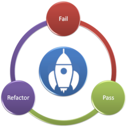

# Katawars - Episode 1: The Time Space Trip

Instrucciones generales:

Os encontráis perdidos en el espacio tiempo, sin rumbo. Una gran explosión ha sacudido los cimientos de vuestra realidad cuando pretendíais aterrizar en Kepler-186f en una rutinaria misión para la recogida de muestras en el planeta. Sin embargo, la explosión de una supernova cercana os ha desplazado más allá de todo lo imaginable, a través del tiempo y del espacio.

Debéis volver a casa. Pero os encontráis en diferentes lugares de la nave, y no podéis hablar entre vosotros. Solo la IA de la nave puede comunicarse con ambos, y, por suerte, os puede enviar las instrucciones que cree convenientes ejecutar. Como no sabe en quién confiar de los dos, os enviará las instrucciones en turnos, uno a uno.

Reglas:
- Las cartas reflejan las instrucciones de la IA. Hay 14 cartas.
- Solo pueden jugar 2 jugadores. Cada jugador comienza con 3 cartas. 
- El primer jugador decide una instrucción a realizar, y escribe su test. La descripción del test (en código) debe ser IX, siendo X el número de carta. 
- El otro jugador implementa el test, y decide cuál de las siguientes instrucciones que tiene en sus cartas quiere ejecutar. Para ello, escoge mentalmente una carta de su mano, y escribe su test.
- El siguiente jugador implementa el test.
- Este jugador, en su turno, si lo desea, puede:
  1) seguir haciendo tests sobre sus cartas actuales, para lo cual, implementará un test, y volverá a enviar dicho test al siguiente jugador.
  2) descartar una o más cartas de su mano, boca abajo encima de la mesa, y coger otra carta (o más, hasta tener 3) para implementar otro test.
- Así sucesivamente, los jugadores deberán implementar los tests del otro jugador. Sin hablar. Sin explicar sus instrucciones, ni sus intenciones.

Resultado final:
- Cuando todos los jugadores ponen boca abajo sus cartas, el juego termina.
- Si un jugador no puede escribir un nuevo test, el juego también termina.
- Entonces debéis ejecutar el script “back-home”, y…
  - Si la nave no puede llegar a su destino, porque las instrucciones “Required” no están bien implementadas, los dos jugadores vagabundearéis en el espacio tiempo y moriréis. ¡Habréis fallado!
  - Si la nave llega a su destino, será momento de saber quién ha aportado más a la aventura. Como resultado del script, se mostrarán los tests que sí pasan y los que no. Cada jugador debe contabilizar los puntos por instrucción que cada test satisfactorio tenga. ¡Gana aquel jugador que más puntos tiene! 

Restricciones:
- No se puede enviar el turno al siguiente jugador si falla más de un test (solo puede fallar el test actual).
- Solo se puede tener un assert / expect por cada test.
- Si los tests no fallan, se pueden añadir tantos tests como se quieran, siempre y cuando estén en verde.
- No puedes pasar un test que no es tuyo en rojo. Todos los tests que no son tuyos deben ir en verde, a excepción del último test, por si quieres “devolverlo”.
- Solo se puede refactorizar, tanto test como código, cuando se está en verde.
- Una vez que una carta se pone boca abajo, no puede releerse su contenido.
- No puedes escribir el mensaje del test en la descripción. La descripción solo puede contener I(seguido de un número). 

Tipos de cartas / instrucciones:
- R / Required: Son cartas básicas, que se deben cumplir si se desea llegar al destino.
- B / Bonus: Son cartas cuyas instrucciones no son obligatorias para llegar al destino, pero si se implementan, dan puntos adicionales. 

Consejos:
- Asegúrate que tu test es lo suficientemente descriptivo. Nada te impide usar patrones de código limpio para que el test exprese tu intención.
- Puedes añadir más tests siempre que estén en verde, por lo que ata tus tests con más tests y/o con data driven tests en ese momento, para reflejar todos los casos de uso posible.
- Algunas cartas bonus son contradictorias entre sí, depende de cómo se implementen. Quizás no es posible implementarlas todas, pero en teoría lo es.
- Un usuario puede devolver el código, tests o ambos, sin ninguna modificación, si así lo desea, ya que puede considerar que el test no está correcto o es imposible de resolverse. Eso sí, ¡aseguraos de que llegáis a un acuerdo, o ninguno de los dos conseguirá volver al destino!

